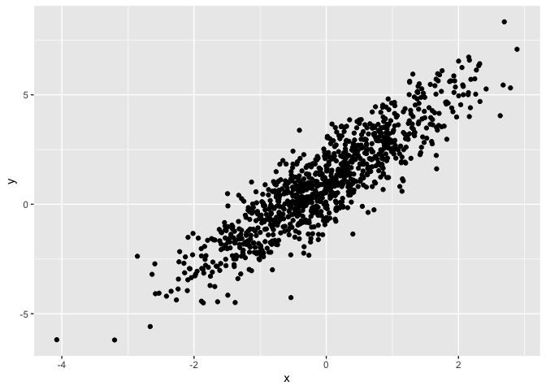

Simple document
================
Elaine Yanxi Chen
2022-09-13

``` r
library(tidyverse)
```

    ## ── Attaching packages ─────────────────────────────────────── tidyverse 1.3.2 ──
    ## ✔ ggplot2 3.3.6     ✔ purrr   0.3.4
    ## ✔ tibble  3.1.7     ✔ dplyr   1.0.9
    ## ✔ tidyr   1.2.0     ✔ stringr 1.4.0
    ## ✔ readr   2.1.2     ✔ forcats 0.5.1
    ## ── Conflicts ────────────────────────────────────────── tidyverse_conflicts() ──
    ## ✖ dplyr::filter() masks stats::filter()
    ## ✖ dplyr::lag()    masks stats::lag()

I’m an R Markdown document!

# Section 1

Here’s a **code chunk** that samples from a *normal distribution*:

**for bold** *italized*

``` r
samp = rnorm(100)
length(samp)
```

    ## [1] 100

# Section 2

I can take the mean of the sample, too! The mean is 0.051364. Can
regulate the digits in 0.05

In-line r code, used very rarely, but useful

# Section 3

## Plot from last time

This is going to make a plot. First I generate a dataframe, then use
`ggplot` to make a scatterplot.

Keystroke for creating a code chunk: Option + Command + I

``` r
plot_df = 
  tibble(
    x = rnorm(n = 1000),
    y = 1 + 2 * x + rnorm(n = 1000)
  )
ggplot(plot_df, aes(x = x, y = y)) + geom_point()
```

<!-- -->

## Plot for learning Assessment

``` r
library(tidyverse)

la_df =
  tibble(
    norm = rnorm(n = 500, mean = 1),
    logical = norm > 0,
    abs_norm = abs(norm)
  )


median_norm = median(pull(la_df, norm))
```

The median of the variable containing absolute values is 1

Here’s a list:

-   List item 1
-   List item 2

Here is a list for the learning assessment:

-   The mean of the original random sample is 0.9474083

-   The median of the sample is 1.0021923

-   The standard deviation of the sample is 0.9792157
